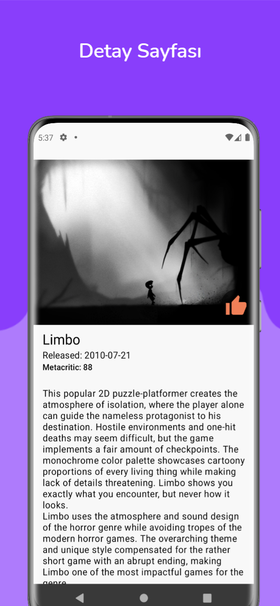

[](https://github.com/scnplt/video-games/actions/workflows/android.yml)

# VideoGames

[Appcent](https://appcent.mobi/) tarafından staj başvurusu sırasında verilen ödev çalışması. Oyunlar ve detaylarının gösterildiği, favori işlemlerinin olduğu mobil uygulama.

## Ekran Görüntüleri

   
   
 

## Kullanım

- Proje içerisinde örnek API anahtarı var fakat dilerseniz [RAWG Video Games](https://rawg.io/apidocs) sitesi üzerinden anahtar alıp bunu 
[GameService.kt](app/src/main/java/dev/sertan/android/videogames/data/service/GameService.kt) dosyasında bulunan `private const val KEY =` karşısındaki anahtar yerine yazıp 
kendi anahtarınız ile kullanabilirsiniz.
- [Firebase](https://firebase.google.com/) entegrasyonları için sitesi üzerinden proje oluşturmalı ve size verilen `google-services.json` dosyasını [app](app/) klasörü altına
koymalısınız. (13 Aralık tarihine kadar bu işlemi yapmadan kullanabilirsiniz bu durumda benim oluşturduğum projeye bağlı olarak çalışacaktır fakat bu süreç sonrasında kendi projenizi bağlamanız gerekecektir.)

## Tema

- Renkler:
  | Gri                                                                       | Turuncu                                                                   |
  |---------------------------------------------------------------------------|---------------------------------------------------------------------------|
  |  `#F8F8F8` |  `#F09676` |
  |  `#E7E7E7` |  `#EF8058` |
  |  `#D7D7D7` |  `#EE6D3E` |
  |  `#575757` |                                                                           |
  |  `#393939` |                                                                           |
  | Black                                                                     | White                                                                     |
  |  `#262626` |  `#FFFFFF` |
  |  `#000000` |

## Kullanılan teknolojiler ve kütüphaneler

- [Hilt](https://developer.android.com/training/dependency-injection/hilt-android)
- [Firebase](https://firebase.google.com/)
- [Navigation](https://developer.android.com/guide/navigation)
- [Data Binding](https://developer.android.com/topic/libraries/data-binding)
- [View Binding](https://developer.android.com/topic/libraries/view-binding)
- [Livedata](https://developer.android.com/topic/libraries/architecture/livedata)
- [Lottie](https://airbnb.io/lottie/#/)
- [Coroutines](https://developer.android.com/kotlin/coroutines)
- [Flow](https://developer.android.com/kotlin/flow)
- [Retrofit](https://square.github.io/retrofit/)
- [Moshi](https://github.com/square/moshi/)
- [Room](https://developer.android.com/training/data-storage/room)
- [Glide](https://github.com/bumptech/glide)
- [Truth](https://truth.dev/)

## Teşekkürler

- [matthew widodo](https://lottiefiles.com/45082-game-controller) - Açılış ekranı animasyonu
- [svgrepo](https://www.svgrepo.com/svg/30556/home) - Ana ekranda kullanılan ev ikonu
- [RAWG](https://rawg.io/apidocs) - Oyun verilerini almak için kullanılan API

## Lisans

```
MIT License

Copyright (c) 2021 Sertan Canpolat

Permission is hereby granted, free of charge, to any person obtaining a copy
of this software and associated documentation files (the "Software"), to deal
in the Software without restriction, including without limitation the rights
to use, copy, modify, merge, publish, distribute, sublicense, and/or sell
copies of the Software, and to permit persons to whom the Software is
furnished to do so, subject to the following conditions:

The above copyright notice and this permission notice shall be included in all
copies or substantial portions of the Software.

THE SOFTWARE IS PROVIDED "AS IS", WITHOUT WARRANTY OF ANY KIND, EXPRESS OR
IMPLIED, INCLUDING BUT NOT LIMITED TO THE WARRANTIES OF MERCHANTABILITY,
FITNESS FOR A PARTICULAR PURPOSE AND NONINFRINGEMENT. IN NO EVENT SHALL THE
AUTHORS OR COPYRIGHT HOLDERS BE LIABLE FOR ANY CLAIM, DAMAGES OR OTHER
LIABILITY, WHETHER IN AN ACTION OF CONTRACT, TORT OR OTHERWISE, ARISING FROM,
OUT OF OR IN CONNECTION WITH THE SOFTWARE OR THE USE OR OTHER DEALINGS IN THE
SOFTWARE.
```
